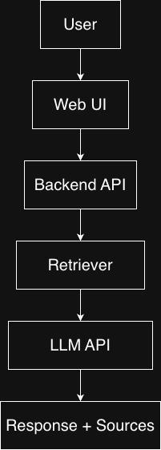

# Internal Knowledge Assistant (IKA)

A cloud-based internal AI assistant designed to provide accurate, document-grounded answers to organizational knowledge while ensuring data security and scalability.

This project demonstrates systems thinking, requirements analysis, and cloud-native architecture design aligned with Technical Business Analyst, Solutions Engineer, and future AI Product Manager roles.

---

## Problem Statement

Employees often spend excessive time searching across fragmented internal documentation (policies, onboarding materials, system docs), resulting in productivity loss and inconsistent information retrieval.

---

## Solution Overview

The Internal Knowledge Assistant (IKA) is a cloud-native AI system that:
- Retrieves relevant internal documents using semantic search
- Generates grounded responses using retrieval-augmented generation (RAG)
- Provides citations to ensure transparency and trust
- Is designed with scalability, security, and reliability in mind

---

## Key Features (MVP)

- Natural-language question answering
- Document ingestion and embedding
- Vector-based semantic retrieval
- LLM-generated answers with citations
- Basic logging and monitoring

---

## High-Level Architecture

---

## Tech Stack (Initial)

- Backend: Python, FastAPI
- Embeddings: OpenAI Embeddings
- Vector Database: FAISS (local, MVP)
- LLM: OpenAI API
- Storage: Local filesystem (S3 planned)
- Cloud Target: AWS (future deployment)

---

## Learning & Career Objectives

This project is designed to demonstrate:
- Translation of business requirements into technical systems
- Cloud and AI system design trade-offs
- Understanding of modern DevOps, scalability, and reliability concepts
- Clear technical communication for stakeholders

---

## Project Status

- [x] Requirements definition
- [x] Architecture design
- [ ] Backend API implementation
- [ ] Document ingestion pipeline
- [ ] Retrieval-augmented QA
- [ ] Cloud deployment

---

## License

